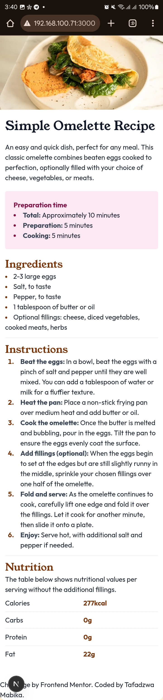

# Frontend Mentor - Recipe page solution

This is a solution to the [Recipe page challenge on Frontend Mentor](https://www.frontendmentor.io/challenges/recipe-page-KiTsR8QQKm). Frontend Mentor challenges help you improve your coding skills by building realistic projects.

## Table of contents

- [Overview](#overview)
  - [The challenge](#the-challenge)
  - [Screenshot](#screenshot)
  - [Links](#links)
- [My process](#my-process)
  - [Built with](#built-with)
  - [What I learned](#what-i-learned)
  - [Continued development](#continued-development)
  - [Useful resources](#useful-resources)
- [Author](#author)
- [Acknowledgments](#acknowledgments)

**Note: Delete this note and update the table of contents based on what sections you keep.**

## Overview

### Screenshot

### Links

- Solution URL: [Here](https://github.com/Unfiltered-On-GH/recipe-page-Frontend-Mentor-Challange)
- Live Site URL: [Here](https://recipe-page-frontend-mentor-challange.vercel.app/)

## My process

### Built with

- [Node JS](https://nodejs.org/) - cross-platform JS runtime environment
- [Next.js](https://nextjs.org/) - React framework
- [Tailwind CSS](https://tailwindcss.com/) - For styles

### What I learned

I have learnt how to style list markers and do multiple line indetention.

### Useful resources

- [Tailwind Documentation](https://tailwindcss.com/docs) - Learn an easier way of writting CSS Code.

## Author

- Website - [Codebench Software Developers](https://www.thecodebench.com.com)
- Frontend Mentor - [@Unfiltered-On-GH](https://www.frontendmentor.io/profile/Unfiltered-On-GH)
- Github - [@Unfiltered-On-GH](https://github.com/Unfiltered-On-GH)
- X - [@MabikaDevelops](https://x.com/MabikaDevelops)

## Acknowledgments

I thank [Frontend Mentors](https://www.frontendmentor.io/profile/Unfiltered-On-GH) for these challanges.
